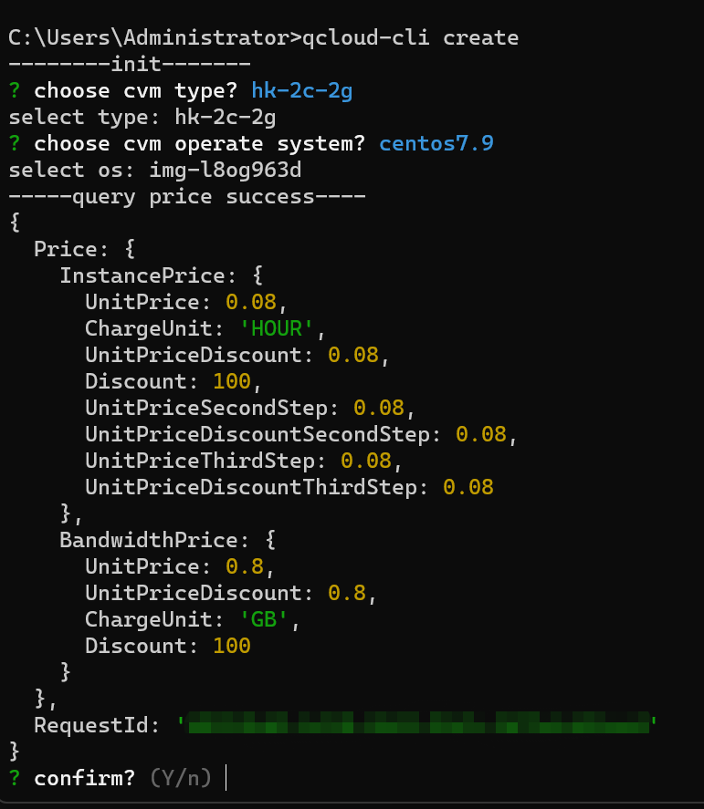

# qcloud-cli
qcloud-cli 是一个基于 Node.js 开发的命令行工具，用于快速创建腾讯云的 CVM 云服务器。

# 特性
快速创建腾讯云 CVM 云服务器
使用命令行界面，简洁高效

# 安装

确保你已经安装 Node.js 和 npm。
npm install -g qcloud-cli

安装完成后，使用以下命令创建CVM云服务器：
qcloud-cli create

# 使用

qcloud-cli 是一个方便用户通过命令行快速创建腾讯云 CVM 云服务器的工具。要使用此工具，您首先需要进行基本的配置。

## 配置文件

当您首次运行 qcloud-cli，它会在您的用户家目录下创建一个名为 qcloud-cli.conf.json 的配置文件。这个文件包含了工具的核心配置，如下：

```json
{
    "credential": {
        "secretId": "",
        "secretKey": ""
    },
    "defaultInfo": {
        "password": ""
    },
    "planList": [
        {
            "name": "hk-2c-2g",
            "payload": {}
        }
    ]
}
```

## 如何配置

#### 1. 凭据信息 (Credential)
为了使工具能够成功调用腾讯云 API，您需要提供您的 secretId 和 secretKey：
```json
"credential": {
    "secretId": "YOUR_SECRET_ID",
    "secretKey": "YOUR_SECRET_KEY"
}
```
您可以在腾讯云控制台的 API 密钥管理部分获取这些信息。

#### 2. 默认信息
此部分存储了创建服务器时的默认密码。请确保密码足够复杂并且安全：
```json
"defaultInfo": {
    "password": "YOUR_DEFAULT_PASSWORD"
}
```
#### 3. 预设的服务器配置 (Plan List)
planList 部分允许您存储多个预设的服务器配置。这可以极大地简化创建特定配置的服务器的过程。每一个预设包含一个名称（name）和一个配置载荷（payload）。

例如，如果您经常创建一个位于香港的2核2G的服务器，您可以这样预设：
```json
{
    "name": "hk-2c-2g",
    "payload": {
        ... // 从 [生成 API Explorer 最佳实践脚本] 复制的配置信息
    }
}
```
当您想要创建这种配置的服务器时，只需要选择预设名称即可。

## 创建服务器
一旦您完成了上述配置，您可以使用以下命令创建服务器：

```shell

qcloud-cli create
# 1、选则预设配置
# 2、选择操作系统
# 3、确认价格
# 4、完成创建

```

创建后会返回CVM实例信息，并自动查询公网IP地址，通常需要30秒左右可以查到公网IP地址

查询到公网IP地址，会自动返回到命令行界面中，可以通过这个公网IP地址去连接服务器


# 注意事项
开通按量付费云主机后，用完后一定记得去腾讯云控制台退还云主机，否则将持续计费！

# 贡献
欢迎对 qcloud-cli 进行贡献！请先 fork 本项目，然后提交您的改动到您的分支，并发起 pull request。

# 许可
此项目使用 MIT 许可证。